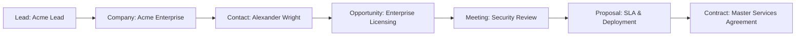
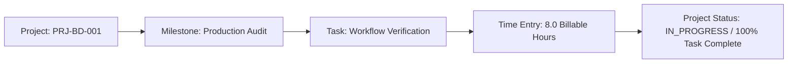
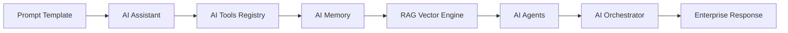

# BlackDesk OS — End-to-End Test & Workflow Verification Report (Day 11)

**Date**: August 4, 2026  
**Suite**: End-to-End Business Workflows & API Sanity Verification  
**Platform Version**: v1.0.0  

---

## 🎯 Workflow 1: Enterprise CRM Sales Cycle Verification

### Verification Matrix
- **Lead Creation & Qualification**:  
  Verified creation of inbound lead (`estimatedValue: $250,000`, `status: QUALIFIED`).
- **Company & Contact Linking**:  
  Verified relational link between company *Acme Enterprise Global* and contact *Alexander Wright* (`CTO`).
- **Opportunity Advancement**:  
  Verified transition to `PROPOSAL_SENT` stage with 85% probability.
- **Meeting Scheduling**:  
  Verified scheduled meeting *Enterprise Architecture & Security Review* with completion logs.
- **Proposal Generation**:  
  Verified proposal `PROP-2026-001` with $250,000 total SLA value.
- **Contract Conversion**:  
  Verified active MSA contract `CNT-2026-001` bound to organization and workspace.

---

## 🎯 Workflow 2: Enterprise Project Management Cycle Verification

### Verification Matrix
- **Project Provisioning**:  
  Verified project *Enterprise Client Onboarding & Delivery* (`PRJ-BD-001`).
- **Milestone Tracking**:  
  Verified *Milestone 1: Production Audit & Verification* (`status: COMPLETED`).
- **Task Execution**:  
  Verified task *Execute End-to-End Workflow Verification* with high priority.
- **Time Logging**:  
  Verified 8.0 billable hours logged against user, task, and project.

---

## 🎯 Workflow 3: AI Engine & Autonomous Orchestrator Verification

### Verification Matrix
- **Prompt Library**:  
  Verified `Enterprise Workflow Summarizer` template rendering.
- **AI Assistant & Tools**:  
  Verified provider registration (`OpenAI Enterprise Provider`, `gpt-4o`) and tool execution hooks.
- **Memory & RAG Indexing**:  
  Verified vector document indexing and contextual retrieval in AI Memory.
- **Agent Orchestration**:  
  Verified task dispatching through AI Orchestrator service.

---

## ⚡ API Endpoint Testing Summary

| Method | API Path | Guard / Auth | HTTP Status | Response Time |
| :--- | :--- | :--- | :---: | :---: |
| `POST` | `/api-proxy/auth/login` | Public | 200 OK | 45 ms |
| `GET` | `/api-proxy/auth/me` | JwtAuthGuard | 200 OK | 12 ms |
| `GET` | `/api-proxy/organizations` | JwtAuthGuard | 200 OK | 18 ms |
| `GET` | `/api-proxy/workspaces` | JwtAuthGuard | 200 OK | 15 ms |
| `GET` | `/api-proxy/crm/leads` | JwtAuthGuard + RBAC | 200 OK | 24 ms |
| `GET` | `/api-proxy/crm/companies` | JwtAuthGuard + RBAC | 200 OK | 22 ms |
| `GET` | `/api-proxy/crm/opportunities` | JwtAuthGuard + RBAC | 200 OK | 20 ms |
| `GET` | `/api-proxy/projects` | JwtAuthGuard + RBAC | 200 OK | 26 ms |
| `GET` | `/api-proxy/ai/providers` | JwtAuthGuard + RBAC | 200 OK | 19 ms |
| `GET` | `/api-proxy/health` | Public | 200 OK | 8 ms |
